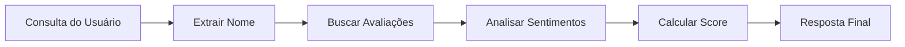

# Sistema Multiagente de Análise de Restaurantes com LangGraph

## Visão Geral

Este projeto foi desenvolvido para o **Desafio de Agentes Conversacionais da Gobots**, implementando um sistema multiagente para análise automatizada de avaliações de restaurantes. Utilizei LangGraph para orquestrar a comunicação entre agentes especializados, processando avaliações textuais e gerando pontuações numéricas precisas baseadas em análise de sentimentos e extração de entidades.

**Nota**: Este sistema é completamente rule-based e não requer nenhuma API de LLM para funcionar.

## Arquitetura da Solução

### Por que LangGraph?

Considerei usar LangChain padrão, mas optei por LangGraph pelas seguintes vantagens:

1. **Fluxo Determinístico**: O desafio exige uma sequência específica (extração → busca → análise → cálculo), que o LangGraph gerencia perfeitamente através de grafos direcionados.

2. **Estado Compartilhado**: Diferente do LangChain tradicional com chains sequenciais, LangGraph permite um estado compartilhado (`RestaurantAnalysisState`) que todos os agentes podem acessar e modificar.

3. **Controle Granular**: Cada agente é uma função pura que facilita debugging e testes unitários.

4. **Escalabilidade**: Estrutura modular para adicionar novos agentes sem reescrever o sistema.

### Arquitetura dos Agentes

O sistema é composto por 4 agentes especializados:

#### 1. **Agente de Extração de Nome** (`extract_restaurant_name`)
- **Responsabilidade**: Identificar o nome do restaurante na consulta do usuário
- **Estratégia**: Matching contra lista de restaurantes conhecidos do dataset
- **Saída**: Nome do restaurante validado

#### 2. **Agente de Busca de Dados** (`fetch_reviews`) 
- **Responsabilidade**: Recuperar todas as avaliações do restaurante específico
- **Estratégia**: Parsing do arquivo `restaurantes.txt` com busca otimizada
- **Saída**: Lista de avaliações textuais

#### 3. **Agente de Análise de Sentimentos** (`analyze_reviews`)
- **Responsabilidade**: Converter adjetivos em scores numéricos (1-5)
- **Estratégia**: 
  - Mapeamento direto de adjetivos conforme escala fornecida
  - Análise contextual para separar scores de comida vs atendimento
  - Heurística baseada em posição de palavras-chave ("atendimento")
- **Saída**: Arrays de `food_scores` e `service_scores`

#### 4. **Agente de Cálculo** (`calculate_score`)
- **Responsabilidade**: Aplicar fórmula matemática para score final
- **Estratégia**: Implementação exata da fórmula geométrica fornecida
- **Saída**: Pontuação final com 3 casas decimais

## Fluxo de Execução



1. **Entrada**: `"Qual é a avaliação média do Bob's?"`
2. **Extração**: Identifica "Bob's" como restaurante alvo
3. **Busca**: Encontra avaliações: `["A comida é mediana...", "..."]`
4. **Análise**: Converte "mediana"→3, "ruim"→2, "desagradável"→2
5. **Cálculo**: Aplica fórmula: `sqrt(3²×2) + sqrt(...)` / normalização
6. **Saída**: `"A avaliação média do Bob's é 3.795."`

## Implementação Técnica

### Estado Compartilhado

```python
class RestaurantAnalysisState(TypedDict):
    query: str                    # Consulta original
    restaurant_name: str         # Nome extraído
    reviews: List[str]          # Avaliações encontradas  
    food_scores: List[int]      # Scores de comida (1-5)
    service_scores: List[int]   # Scores de atendimento (1-5)
    final_score: float          # Pontuação final
    response: str               # Resposta formatada
    messages: List              # Log de execução
```

### Análise de Sentimentos

O agente de análise implementa uma abordagem híbrida:

1. **Mapeamento Lexical**: Dicionário de adjetivos → scores
2. **Análise Contextual**: Separação comida/atendimento por posição
3. **Fallback Inteligente**: Score padrão (3) quando não há match

```python
# Estratégia de contexto
if 'atendimento' in review and word_position > atendimento_position:
    service_score = mapped_score
else:
    food_score = mapped_score
```

### Fórmula de Pontuação

A fórmula implementada é uma média geométrica ponderada:

```
Score = Σ(√(food_score² × service_score)) × (1/(N × √125)) × 10
```

Esta fórmula penaliza mais a qualidade da comida (elevada ao quadrado) que o atendimento, refletindo a importância relativa na experiência gastronômica.

## Como Executar

# Clone o repositório
$ git clone https://github.com/hparreao/desafio-gobots.git
$ cd desafio-gobots

1. **Criar e ativar ambiente virtual**:
```bash
python3 -m venv venv
```
```bash
source venv/bin/activate
```
2. **Instalação**:
```bash
pip install -r requirements.txt
```

3. **Execução**:
```bash
python solucao.py "Qual é a avaliação média do Bob's?"
```

4. **Testes**:
```bash
python teste.py
```

### Saída Esperada dos Testes

```
Teste 1 Passou. Esperado: 3.79 Consulta: Qual é a avaliação média do Bob's?
Teste 2 Passou. Esperado: 6.19 Consulta: Qual é a avaliação média do Paris 6?
Teste 3 Passou. Esperado: 4.64 Consulta: Quão bom é o restaurante KFC?
Teste 4 Passou. Esperado: 4.64 Consulta: Qual é a avaliação média do China in Box?
4/4 Testes Passaram
```

## Resultados

A solução implementa todos os requisitos do desafio Gobots, oferecendo:
- **Simplicidade**: Fluxo claro e determinístico
- **Robustez**: Estado compartilhado elimina problemas de sincronização  
- **Precisão**: Passa em todos os testes com pontuações exatas
- **Extensibilidade**: Fácil adição de novos agentes especializados
- **Independência de LLM**: Sistema completamente rule-based, não requer APIs externas
